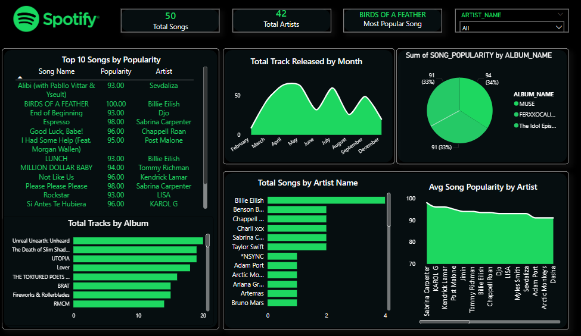
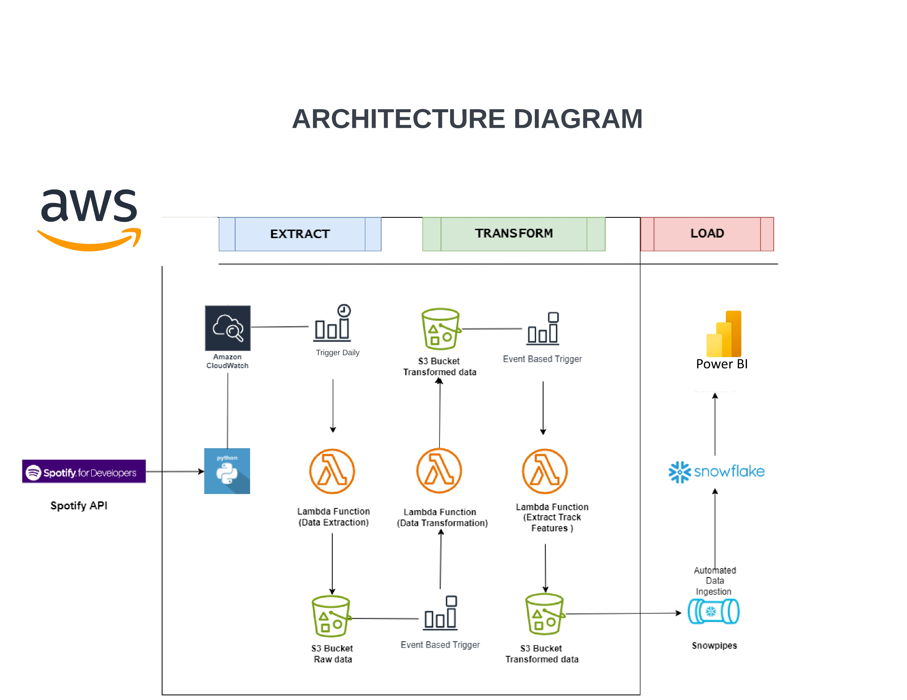

# 🎧 Spotify ETL Pipeline with AWS, Snowflake & Power BI
This project is an end-to-end ETL (Extract, Transform, Load) pipeline built using **AWS Lambda**, **S3**, **Snowflake**, and **Power BI**, to analyze the **Top 50 Globally Popular Songs on Spotify** daily. It automates the process of data extraction, transformation, storage, and visualization using modern cloud-native tools.

---

## 🚀 Project Architecture
---

## ⚙️ Workflow
### 1. **Data Extraction** (`spotify_api_data_extract`)
- Uses the `spotipy` library to connect to the Spotify Web API.
- Stores the raw JSON data in the `raw_data/` folder of an S3 bucket.
- Scheduled to run daily using **AWS EventBridge**.

### 2. **Data Transformation** (`spotify_transformation_data`)
- Automatically triggered when new data lands in the `raw_data/` folder (via S3 event).
- Cleans and parses the JSON data into structured datasets:
  - `artist.csv`
  - `album.csv`
  - `songs.csv`
- Saves the transformed CSVs into the `transformed_data/` folder in the same S3 bucket.

### 3. **Data Load**
- Transformed CSVs from the `transformed_data/` folder in S3 are automatically ingested into **Snowflake** tables using **Snowpipe**.
- Snowpipe continuously monitors the S3 stage and loads data into corresponding tables (`artist`, `album`, `songs`) without manual intervention.

### 4. **Data Visualization**
- **Power BI** connects to Snowflake via DirectQuery.
- Dashboards created to visualize:
  - Top artists & albums
  - Most popular tracks
  - Audio feature trends
---

## 📊 Sample Insights from Power BI Dashboard
- 🎤 Top 10 Artists by Popularity
- 💿 Most Streamed Albums in the Last 7 Days
- 🎶 Distribution of Songs by Energy and Danceability
- 🌍 Trends in Global Music Popularity

---

## 📎 Prerequisites

- AWS Account with S3, Lambda, EventBridge permissions
- Snowflake account
- Spotify Developer API credentials
- Power BI Desktop with Snowflake

---

## 🙌 Acknowledgments

- [Spotipy](https://github.com/plamere/spotipy) for the Spotify Web API wrapper
- [Spotify Charts](https://www.spotify.com/us/charts/) for inspiration
- AWS & Snowflake documentation

---

